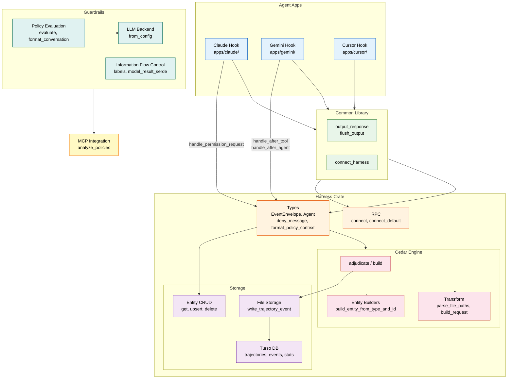

# sondera-coding-agent-hooks Architecture

> 98 files | 1,917 symbols | 161 traced processes

## Overview

sondera-coding-agent-hooks is a **Rust framework** that provides guardrail hooks for AI coding agents (Claude, Gemini, Cursor). It uses **Cedar policies** for fine-grained access control, **LLM-based security guardrails** (injection detection, secret exposure, crypto misuse, path traversal), and **trajectory storage** for audit logging. The architecture follows a layered crate structure with agent-specific apps on top of shared harness and guardrails libraries.

## Functional Areas

| Module | Symbols | Cohesion | Description |
|--------|---------|----------|-------------|
| **App** | 295 | 84% | Agent-specific hook implementations for Claude, Gemini, and Cursor. Common library for output/connection. Response builders (allow, deny, system messages, retries). Install config generation. |
| **Cedar** | 58 | 76% | Cedar policy engine: adjudication, entity construction, request building, policy analysis (via MCP), file path parsing, deny message formatting |
| **Storage** | 30 | 93% | Persistence layer: Turso DB (trajectories, events, stats), file-based trajectory storage, entity CRUD operations |
| **Tests** | 94 | 87% | Cedar policy loading, Ollama integration tests (injection, secrets, crypto, path traversal, access control), type serialization, event/trajectory tests |

## Key Execution Flows

### 1. App Startup — Harness Connection (5 steps)

Agent app boots, runs hook, and connects to the harness via RPC.

```
main                    (apps/gemini/src/main.rs)
  -> run_hook           (apps/gemini/src/main.rs)
    -> connect_harness  (crates/common/src/lib.rs)
      -> connect_default (crates/harness/src/rpc.rs)
        -> connect      (crates/harness/src/rpc.rs)
```

### 2. Policy Evaluation Pipeline (5 steps)

Guardrail policy evaluation: formats conversation context, builds the policy model from config, and initializes the LLM backend.

```
evaluate                (crates/guardrails/policy/src/lib.rs)
  -> format_conversation (crates/guardrails/policy/src/lib.rs)
    -> new              (crates/guardrails/policy/src/lib.rs)
      -> with_config    (crates/guardrails/policy/src/lib.rs)
        -> from_config  (crates/guardrails/llm-backend/src/lib.rs)
```

### 3. Post-Agent Hook — Entity Lookup (4 steps)

After an agent completes, the hook checks deny conditions and retrieves entity context from storage.

```
handle_after_agent       (apps/gemini/src/app/hooks.rs)
  -> deny_message        (crates/harness/src/types.rs)
    -> format_policy_context (crates/harness/src/types.rs)
      -> get             (crates/harness/src/storage/entity.rs)
```

### 4. Cedar Adjudication — Trajectory Logging (4 steps)

Cedar policy adjudication writes decision events to trajectory storage for audit.

```
adjudicate               (crates/harness/src/cedar/mod.rs)
  -> write_trajectory_event (crates/harness/src/storage/file.rs)
    -> get_trajectory_file  (crates/harness/src/storage/file.rs)
      -> get_storage_dir    (crates/harness/src/storage/file.rs)
```

### 5. Permission Request Hook — Entity Lookup (4 steps)

Claude-specific permission request handler checks deny conditions with entity context.

```
handle_permission_request (apps/claude/src/app/hooks.rs)
  -> deny_message          (crates/harness/src/types.rs)
    -> format_policy_context (crates/harness/src/types.rs)
      -> get               (crates/harness/src/storage/entity.rs)
```

## Architecture Diagram



## Directory Map

```
sondera-coding-agent-hooks/
├── apps/                               # Agent-specific hook implementations
│   ├── claude/
│   │   └── src/
│   │       ├── main.rs                 #   Entry point
│   │       └── app/
│   │           └── hooks.rs            #   handle_permission_request
│   ├── gemini/
│   │   └── src/
│   │       ├── main.rs                 #   Entry point (main -> run_hook)
│   │       └── app/
│   │           ├── hooks.rs            #   handle_after_tool, handle_after_agent
│   │           ├── install.rs          #   generate_hooks_config
│   │           ├── response.rs         #   allow, deny, with_system_msg, with_continue
│   │           └── types.rs            #   Hook event types
│   └── cursor/
│       └── src/
│           ├── main.rs                 #   Entry point
│           └── app/
│               ├── response.rs         #   Response builders
│               └── types.rs            #   Hook event types
├── crates/                             # Shared libraries
│   ├── common/
│   │   └── src/lib.rs                  #   output_response, flush_output, connect_harness
│   ├── harness/
│   │   └── src/
│   │       ├── rpc.rs                  #   connect, connect_default
│   │       ├── types.rs                #   EventEnvelope, Agent, deny_message
│   │       ├── cedar/
│   │       │   ├── mod.rs              #   adjudicate, build, get_entity, policy_set
│   │       │   ├── entity.rs           #   Cedar entity builders
│   │       │   └── transform.rs        #   parse_file_paths, build_request
│   │       └── storage/
│   │           ├── file.rs             #   File-based trajectory storage
│   │           ├── entity.rs           #   Entity CRUD (get, upsert, delete)
│   │           └── turso.rs            #   Turso DB (trajectories, events, stats)
│   ├── guardrails/
│   │   ├── policy/
│   │   │   ├── src/lib.rs              #   evaluate, format_conversation, policy model
│   │   │   ├── src/policy.rs           #   Policy categories
│   │   │   └── tests/                  #   Ollama integration tests
│   │   ├── llm-backend/
│   │   │   └── src/lib.rs              #   from_config (LLM backend initialization)
│   │   └── ifc/
│   │       ├── src/label.rs            #   Information flow control labels
│   │       └── tests/                  #   IFC integration tests
│   └── mcp/
│       └── src/lib.rs                  #   analyze_policies (MCP integration)
└── tests/
    └── crates/harness/tests/
        └── cedar_policy_loading.rs     #   Policy loading validation
```

## Technology Stack

| Layer | Technology | Purpose |
|-------|-----------|---------|
| **Language** | Rust (2021 edition) | Performance, safety, async support |
| **Policy Engine** | Cedar | Fine-grained access control policies |
| **Database** | Turso (libSQL) | Trajectory and event storage |
| **RPC** | Unix sockets / gRPC | Harness-to-agent communication |
| **LLM Guardrails** | Ollama (local) | Security policy evaluation (injection, secrets, crypto, path traversal) |
| **MCP** | Model Context Protocol | Policy analysis integration |
| **Testing** | Rust built-in + Ollama | Unit tests, Cedar policy tests, LLM integration tests |
