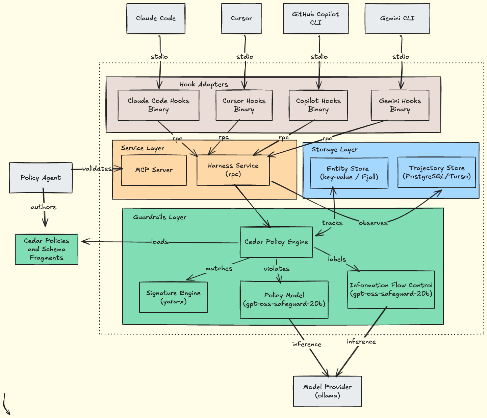
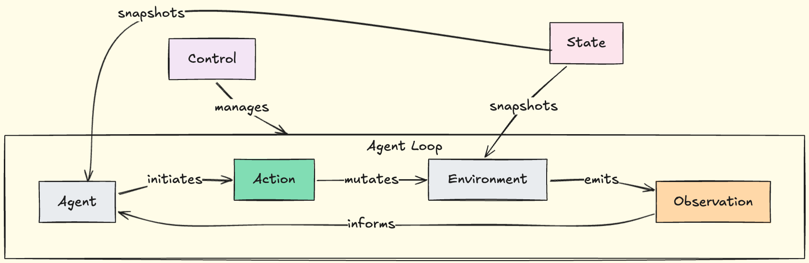

# Coding Agent Hooks by Sondera

> Released as part of the *Hooking Coding Agents with the Cedar Policy Language*
> talk at [Unprompted 2026](https://unpromptedcon.org/).

A reference monitor for AI coding agents. Rust hook binaries and [Cedar](https://docs.cedarpolicy.com/) policies
intercept every shell command, file operation, and web request to forbid
exfiltration and destructive behaviors, and enforce information flow control.
YARA signatures and Cedar policy evaluation are deterministic; the optional
LLM-based classifiers (data sensitivity, secure code policy) are probabilistic.

Works with [Claude Code](https://code.claude.com/docs/en/hooks),
[Cursor](https://cursor.com/docs/agent/hooks),
[GitHub Copilot](https://docs.github.com/en/copilot/how-tos/use-copilot-agents/coding-agent/use-hooks),
and [Gemini CLI](https://geminicli.com/docs/hooks/).

## Getting Started

### Prerequisites

The YARA signature engine and Cedar policies work without any external
dependencies. The LLM-based classifiers (data sensitivity and secure code
policy) require [Ollama](https://ollama.com/) with the `gpt-oss-safeguard-20b`
model:

```bash
# Install Ollama — see https://ollama.com/download for other platforms
brew install ollama

# Pull the model (~12 GB)
ollama pull gpt-oss-safeguard-20b
```

### 1. Start the harness server

The harness server loads Cedar policies and listens on a Unix socket for
hook connections.

```bash
cargo run --bin sondera-harness-server -- -v
```

By default, it loads policies from `./policies` and the socket path is
resolved in order of preference:

| Priority | Path                                    | When                               |
|----------|-----------------------------------------|------------------------------------|
| 1        | `/var/run/sondera/sondera-harness.sock` | Directory exists or can be created |
| 2        | `~/.sondera/sondera-harness.sock`       | Fallback for unprivileged users    |

Override with `--socket`:

```bash
cargo run --bin sondera-harness-server -- \
  --policy-path /path/to/policies \
  --socket /var/run/sondera/sondera-harness.sock \
  -v
```

See [Deployment](#deployment) for more details on socket ownership and permissions.

### 2. Install hooks for Claude Code

The `sondera-claude` binary registers hooks for all Claude Code lifecycle
events (pre-tool-use, post-tool-use, session-start, etc.). Choose a scope:

```bash
# Local (default) — .claude/settings.local.json, not committed to git
cargo run -p sondera-claude -- install

# Project — .claude/settings.json, committed to git, shared with team
cargo run -p sondera-claude -- install --project

# User — ~/.claude/settings.json, applies to all projects
cargo run -p sondera-claude -- install --user
```

To uninstall, use the same scope flag:

```bash
cargo run -p sondera-claude -- uninstall --user
```

Hooks for Cursor (`sondera-cursor`), GitHub Copilot (`sondera-copilot`), and
Gemini CLI (`sondera-gemini`) follow the same pattern.

### 3. Policies

Cedar policies and the schema live in `policies/`. The harness server loads all
`.cedar` and `.cedarschema` files from this directory at startup.

```
policies/
├── base.cedarschema       # Entity types (Agent, Trajectory, Tool, File, Label, Taint) and actions
├── base.cedar             # Default-permit baseline with targeted forbids for prompt injection,
│                          #   credential access, data exfiltration, shell/web/file pre- and
│                          #   post-execution gates, and trajectory-level runaway protection
├── destructive.cedar      # Blocks irreversible operations: rm -rf, git force-push, terraform
│                          #   destroy, DROP DATABASE, lock file deletion, kill -9, and more
├── file.cedar             # File-type-aware guards: Bell-LaPadula IFC (no write-down), private
│                          #   key access, secrets in source code, obfuscation in scripts, and
│                          #   OWASP/CWE policy violations (injection, weak crypto, broken authz)
├── ifc.cedar              # Information flow control: sensitivity-gated outbound blocking,
│                          #   taint propagation guards, network tool restrictions, and
│                          #   step-count limits scaled by data classification level
├── supply_chain_risk.cedar # Supply chain attack detection: typosquatting, dependency confusion,
│                          #   build script injection, lock file tampering, and registry exfiltration
├── ifc.toml               # Prompt templates for LLM-based data classification
└── policies.toml          # Prompt templates for LLM-based secure code generation evaluation
```

Write your own `.cedar` files into this directory to add custom rules. The
harness evaluates all policies on every hook event — a single matching `forbid`
overrides any `permit`.

## Architecture



Agent frameworks (Claude Code, Cursor, Copilot, Gemini CLI) communicate with
per-agent **hook adapter** binaries over stdin/stdout JSON. Each hook binary
forwards events over **tarpc RPC** (Unix socket) to the harness service layer,
which coordinates three guardrail subsystems:

1. **Signature Engine** (YARA-X) — pattern-matches tool inputs/outputs for prompt injection, data exfiltration, secrets,
   and obfuscation.
2. **Policy Model** (gpt-oss-safeguard-20b via Ollama) — classifies content against secure code generation categories.
3. **Information Flow Control** (gpt-oss-safeguard-20b via Ollama) — assigns sensitivity labels for data classification.

The **Cedar Policy Engine** loads policies and schema fragments authored by a
policy agent via the MCP server, combines guardrail signals with entity state
from the **Fjall key-value store**, and returns an adjudication
(Allow / Deny / Escalate) back through the hook binary to the agent.

### Event Model



The harness models agent execution as a trajectory of typed events. Each hook
adapter normalizes its agent-specific JSON into four event categories:

| Category        | Description                                              | Examples                                                                    |
|-----------------|----------------------------------------------------------|-----------------------------------------------------------------------------|
| **Action**      | Agent-initiated operations, evaluated *before* execution | `ShellCommand`, `FileRead`, `FileWrite`, `FileEdit`, `WebFetch`, `ToolCall` |
| **Observation** | Environment responses, evaluated *after* execution       | `ShellCommandOutput`, `FileOperationResult`, `WebFetchOutput`, `Prompt`     |
| **Control**     | Lifecycle events that manage the trajectory              | `Started`, `Completed`, `Failed`, `Adjudicated`                             |
| **State**       | Snapshots of environment context                         | Working directory, open files, git branch                                   |

Each adapter maps agent-specific tool names to these common types — Claude's
`Bash` tool, Cursor's shell execution hook, Copilot's `bash` tool, and Gemini's
`bash` tool all normalize to the same `ShellCommand` action. The harness
evaluates policies against these normalized events, so Cedar rules work
identically across all four agents.

### References

- [Cedar Policy Language](https://docs.cedarpolicy.com/)
- [Claude Code Hooks](https://code.claude.com/docs/en/hooks)
- [Cursor Agent Hooks](https://cursor.com/docs/agent/hooks)
- [GitHub Copilot Hooks](https://docs.github.com/en/copilot/how-tos/use-copilot-agents/coding-agent/use-hooks)
- [Gemini CLI Hooks](https://geminicli.com/docs/hooks/)

## Workspace

| Crate                         | Purpose                                                              |
|-------------------------------|----------------------------------------------------------------------|
| `crates/harness`              | Cedar policy engine, entity store, trajectory storage, tarpc RPC     |
| `crates/guardrails/signature` | YARA-X signature scanning (prompt injection, exfiltration, secrets)  |
| `crates/guardrails/ifc`       | LLM-based data classification (Microsoft Purview sensitivity labels) |
| `crates/guardrails/policy`    | LLM-based policy evaluation (secure code generation categories)      |
| `crates/common`               | Shared I/O utilities for hook binaries (stdin/stdout JSON, tracing)  |
| `crates/mcp`                  | MCP server for interactive Cedar policy authoring                    |
| `apps/claude`                 | Claude Code hooks                                                    |
| `apps/cursor`                 | Cursor hooks                                                         |
| `apps/copilot`                | GitHub Copilot hooks                                                 |
| `apps/gemini`                 | Gemini CLI hooks                                                     |

## Development

```bash
# Test
cargo test --workspace

# Lint
cargo fmt --all -- --check
cargo clippy --all-features -- -D warnings
```

## Deployment

**Production hardening.** The `sondera-harness-server` socket path is security-critical, whichever process
binds it first controls adjudication for all hook clients. Pre-create the directory with restricted ownership to prevent
a rogue process from binding the path before the harness starts:

```bash
sudo mkdir -p /var/run/sondera
sudo chown sondera:sondera /var/run/sondera
sudo chmod 0750 /var/run/sondera
```

On systemd hosts, use `RuntimeDirectory=sondera` in the unit file instead, which creates and locks down `/run/sondera/`
automatically. Avoid the home directory fallback in production, its world-writable parent makes it vulnerable to
pre-binding races.

## License

MIT licensed. See [LICENSE](LICENSE).
