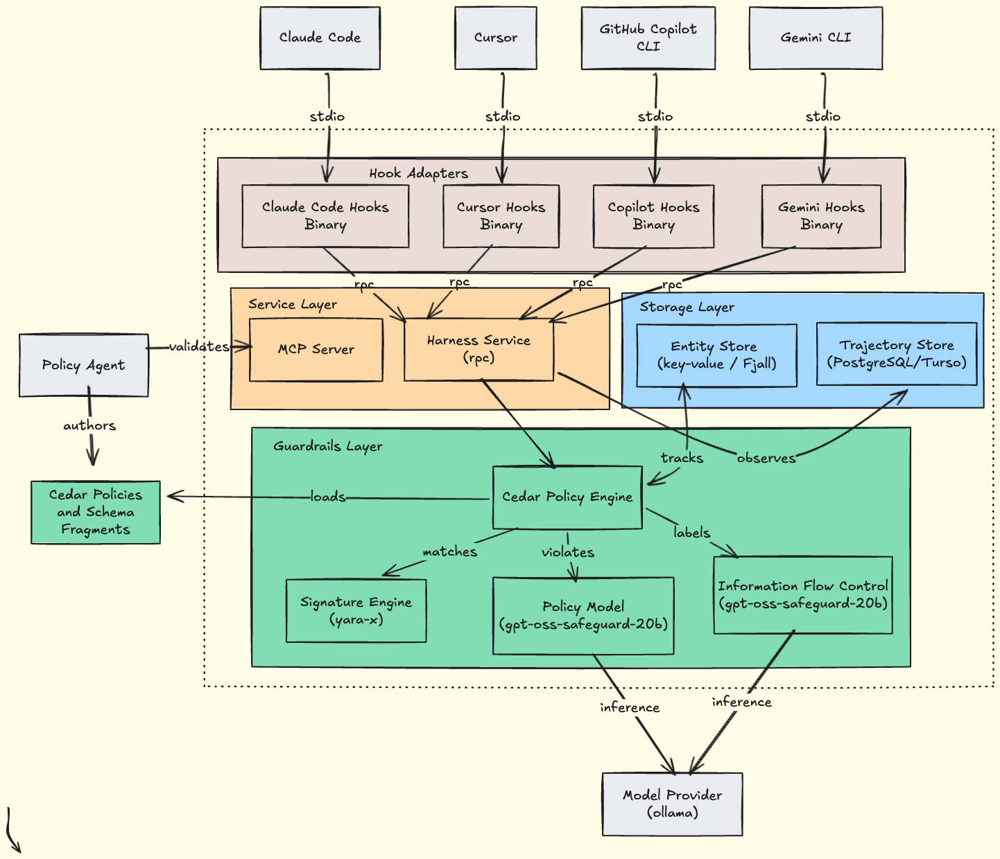
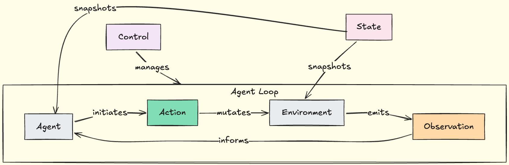

# Coding Agent Hooks by Sondera

> Released as part of the *Hooking Coding Agents with the Cedar Policy Language*
> talk at [Unprompted 2026](https://unpromptedcon.org/).

A reference monitor for AI coding agents. Rust hook binaries and [Cedar](https://docs.cedarpolicy.com/) policies
intercept every shell command, file operation, and web request to forbid
exfiltration and destructive behaviors, and enforce information flow control.
YARA signatures and Cedar policy evaluation are deterministic. The optional
LLM-based classifiers (data sensitivity, secure code policy) are probabilistic
and disabled by default.

Works with [Claude Code](https://code.claude.com/docs/en/hooks),
[Cursor](https://cursor.com/docs/agent/hooks),
[GitHub Copilot](https://docs.github.com/en/copilot/how-tos/use-copilot-agents/coding-agent/use-hooks),
and [Gemini CLI](https://geminicli.com/docs/hooks/), plus adapters for
Antigravity, Codex, Hermes, OpenCode, OpenHands, and VS Code —
`sondera hook --help` lists the full set.

## Getting Started

### Install

Download the archive for Linux x86-64 or Apple silicon from
[GitHub Releases](https://github.com/sondera-ai/sondera-coding-agent-hooks/releases),
then extract it and run from the bundle directory:

```bash
tar -xzf sondera-<target>.tar.gz
cd sondera-<target>
./sondera --help
```

The archive includes the `.sondera/` policy assets required by `sondera serve`,
plus this README and the license. Commands below use `cargo run` from a source
checkout; with an archive, replace `cargo run -p sondera --` with `./sondera`.

To build from source instead, install [Rust](https://www.rust-lang.org/) and
Cargo using rustup:

```bash
# Install Rust and Cargo
curl --proto '=https' --tlsv1.2 -sSf https://sh.rustup.rs | sh

# Verify installation
cargo --version
```

The YARA signature engine and Cedar policies work without any external
dependencies. Model guardrails are off unless a config file turns them on, so the
harness starts and adjudicates with no provider at all. To enable the optional
classifiers — data sensitivity and secure code policy, both gated by the one
key — set `enabled = true` under `[guardrails]` in `.sondera/sondera.toml`, and
point them at a provider. For [Ollama](https://ollama.com/) with the
`gpt-oss-safeguard:20b` model:

```bash
# Install Ollama — see https://ollama.com/download for other platforms
brew install ollama

# Pull the model (~14 GB)
ollama pull gpt-oss-safeguard:20b
```

Ollama is the default when model guardrails are enabled, not a requirement:
the classifiers run against any provider in the registry — OpenAI-compatible
servers, Anthropic, Gemini, Google Cloud Vertex AI, and others — selected in
`.sondera/sondera.toml`. Only content carried by a normalized event is sent to
the configured provider. Shell commands never cause the harness to read guessed
host paths; file content reaches classification through explicit file-operation
events. Vertex AI is
the one provider configured by project and location instead of a key and URL,
since it authenticates with Application Default Credentials:

```toml
[guardrails]
enabled = true
provider = "vertexai"
project = "my-gcp-project"
location = "us-central1"   # optional; defaults to `global`
model = "gemini-2.5-flash"
```

That needs `gcloud auth application-default login` (or a service account on
GCP); `project` and `location` fall back to `GOOGLE_CLOUD_PROJECT` and
`GOOGLE_CLOUD_LOCATION`.

Both classifiers sit on the adjudication path, so enabling them adds latency to
every decision they touch. Size them separately with `[guardrails.data]` and
`[guardrails.policy]`, which override the shared table key by key. The full
resolution rules — scope precedence, per-guardrail overrides, the opt-in
`[scanner]` table, and where each cost is paid — are documented on
`sondera_settings` in `crates/settings/src/lib.rs`, which owns them.

### 1. Start the server

`sondera serve` runs both gRPC surfaces on one address:

| Surface | Where |
|---------|-------|
| `sondera.harness.v1` — adjudication, backed by the Cedar policy engine | `/sondera.harness.v1.HarnessService/…` |
| `sondera.console.v1` — agent and trajectory reads over the same store | `/sondera.console.v1.ConsoleService/…` |

```bash
cargo run -p sondera -- serve -v
```

By default it loads everything from the nearest `.sondera/` directory at or
above the working directory, falling back per asset to `~/.sondera/`, reads and
writes `~/.sondera/trajectories/trajectories.db`, and binds `127.0.0.1:50051`.
Override the bind address with `--addr` (or the `SONDERA_HARNESS_ADDR`
environment variable), the config directory with `--config-dir`, and the
database with `--db`:

```bash
cargo run -p sondera -- serve \
  --config-dir /path/to/.sondera \
  --addr 127.0.0.1:50051 \
  -v
```

Hook clients dial `http://127.0.0.1:50051` by default; override with the
`SONDERA_HARNESS_ENDPOINT` environment variable. See
[Deployment](#deployment) for production notes.

### 2. Browse trajectories in the terminal

`sondera tui` is a read-only view over a running server's console surface:

```bash
cargo run -p sondera -- tui
```

It opens on the **run feed** — verdict, agent, status, event count, duration,
and the digest summary for every recorded run, kept current over
`StreamTrajectories`. `Enter` opens that run's **transcript**: a tree of steps
on the left, with each action's output nested beneath it, and the selected event
in full on the right — prompts rendered as markdown, shell as shell, file writes
in the language of the file, and tool payloads as JSON, followed by the
adjudication and the scanner's read of it.

| Key | Action |
|-----|--------|
| `↑` `↓` / `j` `k` | Move through runs or steps |
| `Enter` | Open a run; fold or unfold a step |
| `Tab` | Switch between the tree and the detail pane |
| `n` | Jump to the next deny or escalate |
| `E` / `C` | Expand or collapse every step |
| `/` | Filter the feed (agent, id, status, summary) |
| `r` | Refresh the current screen and restart its stream |
| `t` | Toggle light and dark |
| `Esc` | Back to the feed |

It dials `http://127.0.0.1:50051` by default — override with `--endpoint` or
`SONDERA_CONSOLE_ENDPOINT`. `--filter` accepts the console's clause grammar
(`agent=agents/{id}`, `decision=deny`, `status=running`). `--no-live` reads an
opened transcript as a snapshot; `r` reloads it. The theme honours `NO_COLOR`
and `SONDERA_THEME`.

### 3. Install hooks for Claude Code

`sondera hook claude` registers hooks for all Claude Code lifecycle events
(pre-tool-use, post-tool-use, session-start, etc.). Choose a scope:

```bash
# Local (default) — .claude/settings.local.json, not committed to git
cargo run -p sondera -- hook claude install

# Project — .claude/settings.json, committed to git, shared with team
cargo run -p sondera -- hook claude install --project

# User — ~/.claude/settings.json, applies to all projects
cargo run -p sondera -- hook claude install --user
```

To uninstall, use the same scope flag:

```bash
cargo run -p sondera -- hook claude uninstall --user
```

Hooks for Cursor (`sondera hook cursor`), GitHub Copilot (`sondera hook copilot`),
and Gemini CLI (`sondera hook gemini`) follow the same pattern.

### 4. Policies

Cedar policies and the schema live in `.sondera/policies/cedar/`. At startup the
harness loads them through a `StaticPolicyStore`, which walks that directory and
every subdirectory and compiles all `.cedar` and `.cedarschema` files it finds.

The three policy assets resolve independently and nearest-wins, so a project
`.sondera/` need only carry what it overrides — anything it omits comes from
`~/.sondera/`.

One policy per file, each file named for its `@id` — 110 policies in 110 files,
so the directory listing *is* the coverage list:

```
.sondera/
├── sondera.toml               # Bind address and guardrail model settings
├── policies/cedar/            # Everything Cedar; walked recursively
│   ├── base.cedarschema       # Entity types (Agent, Trajectory, Tool, File, Label) and
│   │                          #   actions, declared under `namespace Sondera { … }`
│   ├── base.cedar             # Default-permit baseline; every governance rule below is a `forbid`
│   ├── forbid-*.cedar         # 77 targeted rules: destructive operations, secret/private-key
│   │                          #   writes, prompt and result injection, supply-chain tampering
│   ├── lol-*.cedar            # 28 living-off-the-land rules: credential-store reads, shell-profile
│   │                          #   and systemd/launchd/cron persistence, log and audit tampering
│   └── ifc-forbid-*.cedar     # 4 information-flow rules: sensitivity-gated outbound blocking
│                              #   across the shell egress and WebFetch surfaces
├── ifc.toml                   # Prompt templates for LLM-based data classification
└── policies.toml              # Prompt templates for LLM-based secure code generation evaluation
```

Query coverage with the MCP server's `query_baseline_coverage` rather than
reading the tree, which reports what a given surface already forbids and whether
an `@id` is free.

Add custom rules by dropping `.cedar` files anywhere under
`.sondera/policies/cedar/` —
nesting is free, since the store recurses. Qualify every type with the schema
namespace (`Sondera::Action::"ShellCommand"`). The harness evaluates all policies
on every hook event; a single matching `forbid` overrides any `permit`.

### 5. Author policies with an AI assistant

`sondera mcp` is an MCP server for writing those Cedar policies. It grounds an
assistant in this engine rather than in Cedar generally:

- **Resources** — `cedar://harness/authoring-guide` (how to draft for this
  engine), `cedar://harness/schema` (the authoritative field surface), and the
  baseline's default-permit root.
- **`query_baseline_coverage`** — what the shipped baseline already forbids on a
  given surface, and whether an `@id` is taken. The baseline is 110 policies,
  which is a query, not a document.
- **`get_cedar_policy_context_features`** — the closed sets a condition must
  match exactly (signature categories, policy violation codes, sensitivity
  labels), read from the same definitions the engine matches on.
- **`validate_policy`** — Cedar parse, required `@id`/`@description`,
  duplicate-id detection, schema validation, and semantic lints for conditions
  that typecheck but can never fire. Verify-only: the candidate comes back
  unchanged, with structured findings and a record of which checks ran.
- **`autoformalize`** — a prompt that runs that loop for one natural-language
  rule.

The remaining tools are a Cedar scratchpad — load a schema and policies, manage
entities, run `is_authorized` — for trying a policy out by hand.

MCP clients launch it themselves as a subprocess over stdio — it is a per-client
authoring session, not a shared server, so it is its own command rather than an
endpoint on `sondera serve`. For Claude Code:

```bash
claude mcp add sondera -- cargo run --quiet -p sondera -- mcp
```

Installed as a binary, that command is just `sondera mcp`. The working set —
schema, policies, entities — lives in the process and is gone when the client
disconnects; writing a rule out means saving it under
`.sondera/policies/cedar/`.

## Architecture



Each supported agent invokes `sondera hook <provider>` once per lifecycle event
and speaks stdin/stdout JSON to it. The adapter normalizes that payload and
forwards it over **gRPC** to `sondera serve` (loopback TCP, `127.0.0.1:50051` by
default), which coordinates three guardrail subsystems:

1. **Signature Engine** (YARA-X) — pattern-matches tool inputs/outputs for prompt injection, data exfiltration, secrets,
   and obfuscation. Always on, and the only one of the three that is
   deterministic.
2. **Policy Model** — optionally classifies content against the secure-code
   categories in `.sondera/policies.toml`, filling `context.policy.violations`
   with the codes it reports.
3. **Information Flow Control** — optionally assigns sensitivity labels, filling
   `context.label`.

Subsystems 2 and 3 run against whichever LLM provider `.sondera/sondera.toml`
selects, and both are off unless `[guardrails] enabled = true`. Each fails open
when disabled, erroring, or slower than the adjudication budget — to compliant
with no violations, and to `Public` — so Cedar still runs and the deterministic
policies still decide.

The **Cedar Policy Engine** loads policies and schema fragments — authorable by
a policy agent through the MCP server — combines guardrail signals with entity
state from the **Turso (SQLite) local store**, and returns an adjudication
(Allow / Deny / Escalate) back through the hook adapter to the agent. If the
harness cannot be reached, enforcement hooks **fail closed**.

### Event Model



The harness models agent execution as a trajectory of typed events. Each hook
adapter normalizes its agent-specific JSON into four event categories:

| Category        | Description                                              | Examples                                                                    |
|-----------------|----------------------------------------------------------|-----------------------------------------------------------------------------|
| **Action**      | Agent-initiated operations, evaluated *before* execution | `ShellCommand`, `FileRead`, `FileWrite`, `FileEdit`, `WebFetch`, `ToolCall` |
| **Observation** | Environment responses, evaluated *after* execution       | `ShellCommandOutput`, `FileOperationResult`, `WebFetchOutput`, `Prompt`     |
| **Control**     | Lifecycle events that manage the trajectory              | `Started`, `Completed`, `Failed`, `Adjudicated`                             |
| **State**       | Snapshots of environment context                         | Working directory, open files, git branch                                   |

Each adapter maps agent-specific tool names to these common types — Claude's
`Bash` tool, Cursor's shell execution hook, Copilot's `bash` tool, and Gemini's
`bash` tool all normalize to the same `ShellCommand` action. The harness
evaluates policies against these normalized events, so one Cedar rule set
governs every supported agent.

### References

- [Cedar Policy Language](https://docs.cedarpolicy.com/)
- [Claude Code Hooks](https://code.claude.com/docs/en/hooks)
- [Cursor Agent Hooks](https://cursor.com/docs/agent/hooks)
- [GitHub Copilot Hooks](https://docs.github.com/en/copilot/how-tos/use-copilot-agents/coding-agent/use-hooks)
- [Gemini CLI Hooks](https://geminicli.com/docs/hooks/)

## Workspace

| Crate                         | Purpose                                                              |
|-------------------------------|----------------------------------------------------------------------|
| `crates/harness`              | gRPC harness transport, background scan dispatch, and hook-side client |
| `crates/policy/cedar`         | Cedar policy engine and event-to-context transformation              |
| `crates/storage`              | Turso (SQLite) local store: event ledger, agent registry, Cedar entities |
| `crates/guardrails/signature` | YARA-X signature scanning (prompt injection, exfiltration, secrets)  |
| `crates/guardrails/ifc`       | LLM-based data classification (Microsoft Purview sensitivity labels) |
| `crates/guardrails/policy`    | LLM-based policy evaluation (secure code generation categories)      |
| `crates/provider`             | Runtime-selected LLM backbone shared across Sondera applications    |
| `crates/types`                | Shared domain types (trajectory, events, errors)                     |
| `crates/schema`               | Protobuf / gRPC schema for `sondera.harness.v1` and `sondera.console.v1` |
| `crates/mcp`                  | MCP server for interactive Cedar policy authoring                    |
| `crates/hooks/core`           | Shared hook runtime: install, dispatch, response shaping             |
| `crates/hooks/<provider>`     | Per-provider hook adapters — see [crates/hooks/README.md](crates/hooks/README.md) |
| `crates/console`              | Console gRPC surface over the local agent/trajectory store           |
| `crates/tui`                  | Terminal reading view: the run feed and one run's event transcript   |
| `apps/sondera`                | Unified `sondera` CLI: per-provider hooks, `serve`, `mcp`, and `tui` |

`crates/harness` is depended on twice: in full by the server, and as
`sondera-harness-client` (the same package with `default-features = false,
features = ["client"]`) by every hook adapter, so a hook links only the gRPC
client and not the policy engine.

## Development

The same commands CI runs:

```bash
# Format, lint, and documentation
cargo fmt --all -- --check
cargo clippy --locked --all-features -- -D warnings
cargo doc --locked --no-deps --workspace

# Test
cargo test --locked --workspace

# Supply chain
cargo deny check
```

CI also runs `buf lint` and `buf format --diff --exit-code` from
`crates/schema/proto/`.

Integration tests that need a reachable model provider are `#[ignore]`d by
default; run them explicitly with `cargo test -- --ignored` once the provider in
`.sondera/sondera.toml` is up.

## Deployment

**Production hardening.** `sondera serve` binds `127.0.0.1:50051` by default, so
it is reachable only from the local host. Whichever process binds the address
first controls adjudication for all hook clients, and neither surface
authenticates its caller: adjudication is plain HTTP/2 gRPC, while the console
returns the whole local store and exposes agent deletion.
Keep the bind address on loopback (or a private interface) and do not expose it
publicly without an authenticating proxy in front. Point hook clients at the
harness with `SONDERA_HARNESS_ENDPOINT`.

`sondera mcp` binds nothing: it speaks JSON-RPC over the stdio pipes of whatever
client launched it, so its reach is that client's.

## License

MIT licensed. See [LICENSE](LICENSE).
